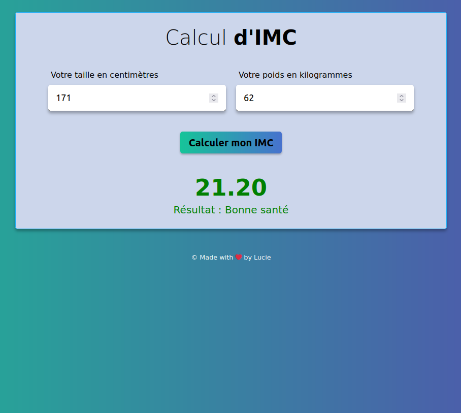

# Calculateur d'IMC (BMI) en JavaScript

J'ai réalisé ce calculateur d'IMC (Indice de Masse Corporelle ou BMI (Body Mass Index) en anglais).
Il s'agit de mon premier projet en JavaScript natif. C'est donc assez basique.

On y rentre sa taille et son poids pour obtenir un résultat.

# Calculateur d'IMC (BMI) en JavaScript

J'ai réalisé ce calculateur d'IMC (Indice de Masse Corporelle ou BMI (Body Mass Index) en anglais).
Il s'agit de mon premier projet en JavaScript natif. C'est donc assez basique.

On y rentre sa taille et son poids pour obtenir un résultat.

